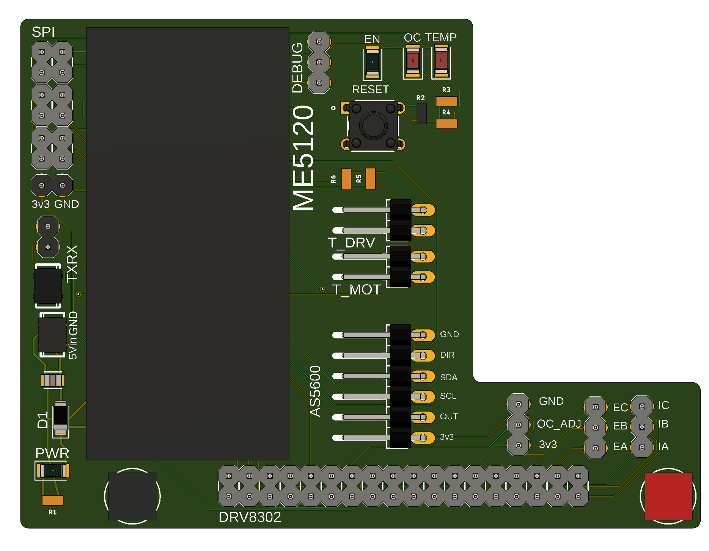

# DRV8302 Control via Raspberry Pi Pico

This tutorial follow the minimun requirements to control BLDC motors with close loop using AS5600 encoder and DRV8302 driver.

You can check more info at [DRV8302 arduino-simpleFOC example.](https://docs.simplefoc.com/drv8302_example)





## Usage
- Clone repository
- Install SimpleFOC Arduino library
- Upload [firmware](position_motor/position_motor.ino) file to the RPi Pico
- Connect the hat via UART
- Open the serial port at 115200 baudrate using arduino monitor or python script with pyserial.
- Send positions commands and check the motor moves.

```sh
# Clone repository
git clone https://github.com/LabRobDIMEC/ICRA_LA_CHILE_HO1b.git
```

### Input target position in radians: `T001` (1 radian in positive direction). Do not forget, this is the motor position, but not the actuator output position.